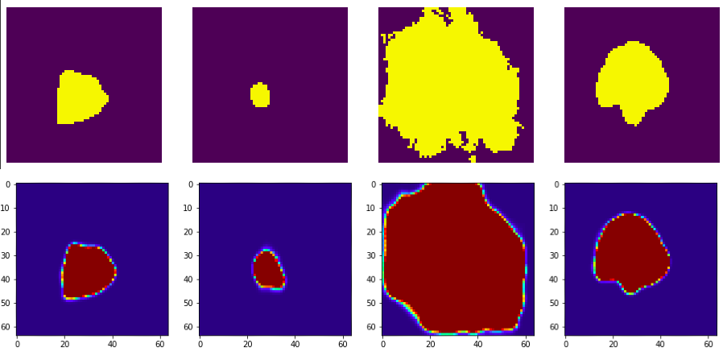
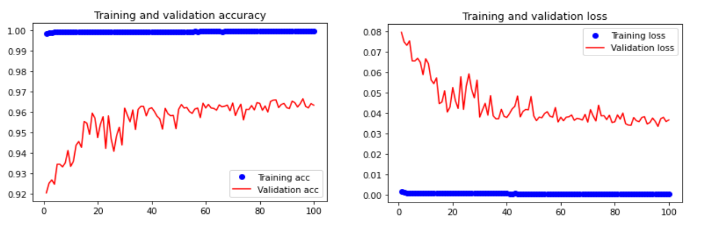

# Melanoma Segmentation using Bi-Directional Conv LSTM UNET 


Malignant melanoma segmentation using bi-directional convolutional lstm unet architecture. 

## Baseline Architecture 

>The baseline architecture used is UNET architecture, which was proposed by Olaf Ronneberger et al., from University of Frieburg in 2015 ISBI challenge for segmentation of neuronal structures in electron microscopic stacks. 

<p align="center"></p>

## Results 

>The predictions of the model are shown below, the first row containts the ground truth images and the second row contains predicted masks.

<p align="center"></p> 

## Training Accuracy and Loss Plots

<p align="center"></p> 

## Dataset

>Dataset used is ISIC 2018 skin lesion images dataset. It consists of 2594 skin lesion images and their corresponding binary masks.It is preprocessed and each image is resized to 64x64 for faster computation.
```
https://isic-challenge-data.s3.amazonaws.com/2018/ISIC2018_Task1-2_Training_Input.zip 

``` 
## Training Model 

```
train_model.py 

test_model.py

``` 
